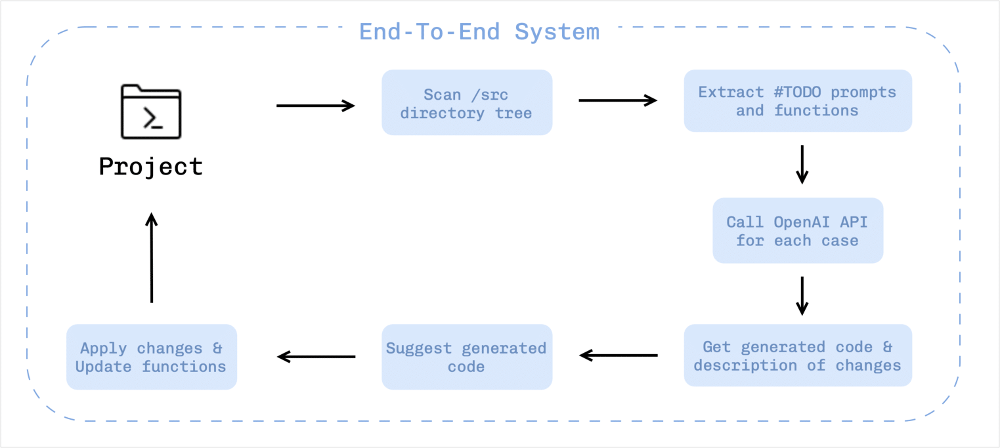
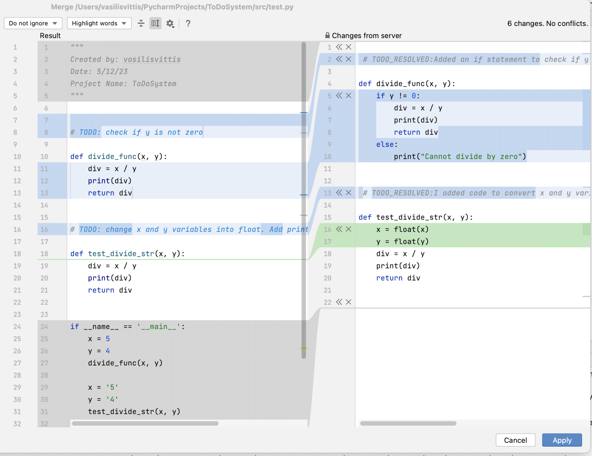

# ToDo AI
## TO-DO code injections from natural language assignement
Vasileios Vittis, Armand Asnani

### Introduction 
To the best of our knowledge, we have not seen so far any tool that can handle such functionality. We realized that these "TODO" assignments that many developers today use have untapped potential and can be exploited to improve the software development process. Current solutions are code (auto) completion approaches that focus on supporting developers in real time code production by prompting potential code block candidates. On the other hand, we provide asynchronous and complete code block suggestions with text descriptions of the changes by opening a dialog window with the user. We say that our approach is complete because we believe that it gives a better experience to developers when they have multiple undone code blocks pending for completion and can utilize AI to address them at once. Therefore the first part of our project is a step towards answering our first two Research Questions.

We found that there is no such approach, which does not use artificial intelligence, that can take a natural language description of the expected behavior of a code and generate appropriate tests. So far, there are approaches, such as Swami \cite{Swami}, that take specific test descriptions from natural language and they provide a resulting test suite that meets the requierements of the specification. A different approach which gives more freedom to the degree of language to the prompts is Toradacu \cite{Toradacu} that does not require strict structure in the natural language, but yet again tackles a completely different problem. What we would like to have done also is to build a separate artificial intelligence component that independently evaluates the GPT generated code suggestions in an online manner. As the name of GPT signifies by itself (Generative Pre-trained Transformers) provide code generation answers based on a pre-trained model and some given dataset. If we have used the same model to generate code and test it, we have a chicken-and-egg situation where we would not be able to provide any guarantees on the generated code block.

What we are contributing at this part of the project is an example TODO prompt framework and an independent evaluation process that the GPT model has not been trained on, so we can ensure that the code suggestions have substance.

### Solution Description
The proposed approach is an end-to-end system able to support IDE's "TODO" instructions, in the JetBrain oracle. The current state of the project is a proof of concept with many limitations. The following diagram shows the steps of our system.

The system first scans the designated source directory tree by looking for Python files.  At the next step, for each file it applies a set of parsing rules in order to find all TODO comments and the functions that they are referring to. After collecting all the candidate code blocks and their respective TODO comments, it calls the OpenAI API, asking to generate the code block that meets the instructions.

We have carefully constructed such a prompt that guides the GPT to a more stable answer with no ambiguities in order to reduce noise. Specifically, we constructed a prompt framework to inject TODO comments into and receive both an executable code block as well as a description of changes. For each code block, we keep a history table of all answers and we discard it when the code block is resolved. The system creates a temporary folder where it stores all the temporary files that contain the generated code. When we have generated the  code blocks for all functions of each file, we show a typical diff-and-merge window that asks the user which of the changes they would like to merge.

We designed it to use a familiar and tested interface in order to display the generated code changes. On the left window of Figure 2, we see the existing TODO comments with their respective functions. On the right window of same figure, we see that for each function there is a comment tagged with $TODO\_{RESOLVED}$ that explains to the user what changes have been made to their code and the code with the actual changes. Between these two windows and for each of the suggestions, there are a set of icons (arrow and cancel) that the user can select in order to accept or reject the changes.
