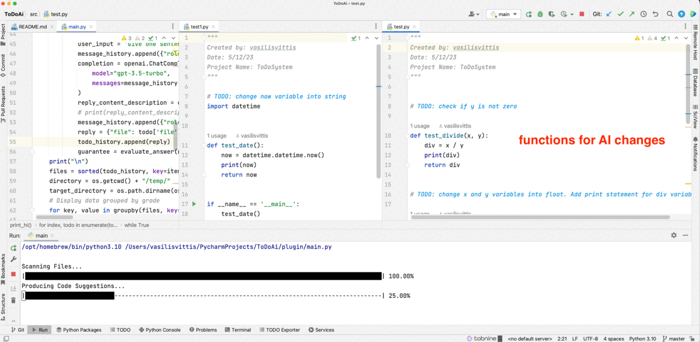

# "To-do"code injections from natural language assignments
Vasileios Vittis, Armand Asnani

Many times in complex and extended software programs, individual software engineers generate lines of code that serve the current short-term goals of a project plan, along side with comments for
future "to-do" assignments. These "to-do" assignments are usually simple future references for optimizations, improvements or possible changes that should be done in one or multiple functions. In
practise, these assignments are being postponed, creating a long list of "fixes" that should be resolved in the near future. This work solves the problem when new code blocks require functionalities
from old ones that contain un-finished "to-do" assignments. The proposed project takes existing code blocks, with "to-do" guidelines and generates new code blocks that preserve the existing structure.
Such changes are asserts, changes in data types or even adding functionality (check if the input variable x is an odd number). Also, this work considers "to-do" assignments for the connection of
different functions (this function does not need to return this structure $z$, just the variable $x$ is enough). Algorithmic assignments are not supported by this work (implement an algorithm with
better running time). Finally, a new test set is also created, ensuring that the new code block successfully satisfies the guidelines. 
